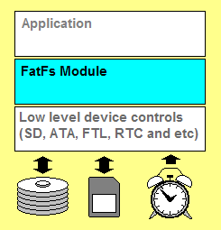

# FatFs - 通用FAT文件系统模块

> 本站是该项目的重构版本，旨在提供更现代化的阅读体验。**原官网地址**：[**https://elm-chan.org/fsw/ff/**](https://elm-chan.org/fsw/ff/)

{ align=right width="250" }

FatFs 是一个面向小型嵌入式系统的通用 FAT/exFAT 文件系统模块。它完全遵循 ANSI C (C89) 标准编写，并与磁盘I/O层完全分离。因此，它独立于具体硬件平台和存储设备，可以轻松集成到资源有限的微控制器中，如 8051, PIC, AVR, ARM, Z80, RX 等。

### 主要特性

*   兼容 DOS/Windows 的 FAT/exFAT 文件系统。
*   平台独立，易于移植。
*   极小的代码和工作区内存占用。
*   丰富的配置选项，支持：
    *   长文件名（支持 ANSI/OEM 或 Unicode）。
    *   exFAT 文件系统。
    *   为实时操作系统（RTOS）提供线程安全。
    *   多卷（物理驱动器和分区）。
    *   可变扇区大小。
    *   多种代码页。

### 核心API

{ align=right width="250" }

FatFs 提供了一套标准的、类似 `stdio.h` 的文件操作接口。

*   **文件访问**: [`f_open`](api/open.md), [`f_close`](api/close.md), [`f_read`](api/read.md), [`f_write`](api/write.md), [`f_lseek`](api/lseek.md) 等。
*   **目录访问**: [`f_opendir`](api/opendir.md), [`f_readdir`](api/readdir.md) 等。
*   **文件管理**: [`f_stat`](api/stat.md), [`f_unlink`](api/unlink.md), [`f_rename`](api/rename.md), [`f_mkdir`](api/mkdir.md) 等。
*   **卷管理**: [`f_mount`](api/mount.md), [`f_mkfs`](api/mkfs.md), [`f_getfree`](api/getfree.md) 等。

### 媒体访问接口

{ align=right width="250" }

由于 FatFs 模块是独立于平台和存储介质的*文件系统层*，它与内存卡、硬盘等物理设备完全分离。存储设备控制模块*并非 FatFs 模块的一部分*，需要由开发者自行实现。FatFs 通过如下所示的简单媒体访问接口来控制存储设备。

### 资源

*   **入门指南: [FatFs 应用笔记](api/appnote.md)**
*   **下载:** [FatFs R0.16](arc/ff16.zip) | [更新历史](updates.html) | [最新补丁](patches.html)
*   **示例项目:** [适用于各平台的 FatFs 示例项目](ffsample.zip)
*   **官方文档:** [微软FAT32规范](https://msdn.microsoft.com/en-us/windows/hardware/gg463080.aspx)
*   **相关链接:**
    *   [FAT文件系统基础](https://elm-chan.org/docs/fat_e.html)
    *   [exFAT文件系统基础](https://elm-chan.org/docs/exfat_e.html)
    *   [如何使用 MMC/SDC](https://elm-chan.org/docs/mmc/mmc_e.html)
    *   [性能测试 1](res/rwtest1.png)
    *   [性能测试 2](res/rwtest2.html)
    *   [应用演示视频](res/fd.html)